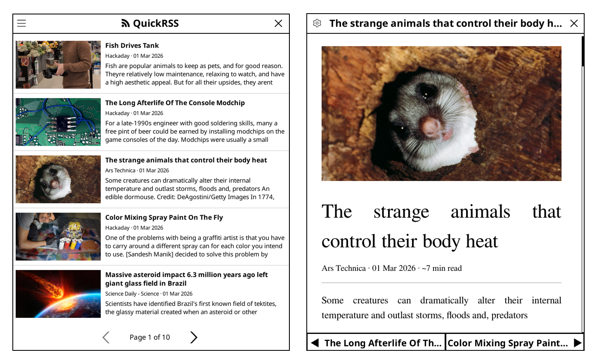

A fast, standalone and easy to use RSS reader plugin for [KOReader](https://github.com/koreader/koreader). Browse and read articles from your favourite feeds without leaving your e-reader.

## Features



**Feed list view**
- Thumbnail cards with a 16:9 cover-cropped image, bold title, source · date line, and a snippet preview
- Paginated list with swipe or hardware page-turn key navigation
- Pull-to-refresh fetches all feeds and updates the cache in one tap

**Article reader**
- Full HTML rendering via KOReader's built-in engine (paragraphs, bold, lists, images)
- Banner image at the top, followed by title, source · date · estimated reading time
- Swipe left/right or use the footer buttons to move between articles
- Full e-ink refresh on open to eliminate ghosting

**Reader customisation**
- Font picker (any font installed on the device)
- Font size up to 64 pt
- Adjustable line spacing

**Image caching**
- Thumbnails & article content images are pre-fetched at fetch time so cards load instantly
- Orphaned images are cleaned up automatically after each fetch
- Independent settings to disable thumbnail images and/or article images

**Full-text extraction**
- Truncated RSS summaries are automatically enriched with full article text via [FiveFilters](https://fivefilters.org/)
- Can be toggled off for privacy or speed
- Supports custom extraction service URLs (e.g. a self-hosted FiveFilters instance)

**Offline-first**
- Articles are cached to disk and available without a network connection
- Configurable cache expiry (default: 10 days)
- Configurable per-feed article limit (default: 20 articles)

**OPML support**
- Feeds are stored as a .opml file
- Can be edited from a computer (`koreader/settings/quickrss_feeds.opml`) or directly from the UI (**≡** → **Feeds**)

## Installation

1. Copy the `quickrss.koplugin/` directory into your KOReader plugins folder:

   | Platform | Path |
   |---|---|
   | Linux desktop | `~/.config/koreader/plugins/` |
   | Kindle | `/mnt/us/extensions/koreader/plugins/` |
   | Kobo | `.adds/koreader/plugins/` |
   | PocketBook | `applications/koreader/plugins/` |

2. Restart KOReader.
3. Open the search menu → **QuickRSS**.

### Development (Linux desktop)

```bash
./deploy.sh
```

This syncs the plugin to `~/.config/koreader/plugins/quickrss.koplugin/`, kills any running KOReader instance, and restarts it.

## Usage

### Adding feeds

1. Open QuickRSS from the KOReader main menu.
2. Tap the **≡** (hamburger) icon → **Feeds**.
3. Tap **Add feed**, enter a name and the RSS/Atom URL, then save.

### Fetching articles

Tap **≡** → **Fetch Articles**. QuickRSS fetches all configured feeds, downloads thumbnails, and updates the cache. A progress indicator shows the current feed being loaded.

### Reading an article

Tap any card in the list to open the article reader. Swipe left/right or tap the **◀** / **▶** footer buttons to navigate between articles. Tap **✕** to return to the feed list.

### Settings

Tap **≡** → **Settings** to configure:

| Setting | Default | Description |
|---|---|---|
| Items per feed | 20 | Maximum articles fetched per feed |
| Cache max age | 30 days | How long before the cache is treated as empty (0 = never expire) |
| Thumbnail images | On | Enable/disable thumbnail images in the feed list |
| Article images | On | Enable/disable images inside articles |
| Card font size | 14 | Font size for article cards in the feed list |
| Full-text extraction | On | Fetch full article text for truncated feeds via extraction service |
| Extraction URL | Default | URL of the full-text extraction service (for self-hosted instances) |

Reader font, font size, and line spacing can be changed from within any open article via the **⚙** icon in the title bar.

### Clearing the cache

Tap **≡** → **Clear Cache** to wipe all cached articles and images. The next **Fetch Articles** will start fresh.

## Project structure

```
quickrss.koplugin/
├── main.lua                    Plugin entry point — registers to KOReader main menu
├── _meta.lua                   Plugin metadata (name, version, author)
└── modules/
    ├── ui/                     UI widgets and screens
    │   ├── feed_view.lua       Main feed list UI and pagination
    │   ├── article_item.lua    Individual article card widget
    │   ├── article_reader.lua  Full-screen HTML article reader
    │   ├── feed_list.lua       Feed management popup (add / remove feeds)
    │   ├── settings.lua        Article settings popup
    │   ├── reader_settings.lua Reader font / size / spacing popup
    │   ├── settings_row.lua    Shared settings row builder
    │   └── icons.lua           Unicode icon constants
    ├── data/                   Data, persistence, and networking
    │   ├── config.lua          Persistent settings (feeds, article limits, reader prefs)
    │   ├── cache.lua           Article and image cache management
    │   ├── parser.lua          RSS / Atom feed fetching and parsing
    │   ├── opml.lua            OPML feed-list reader / writer
    │   └── images.lua          Image downloading and HTML image rewriting
    └── lib/                    Third-party libraries
        ├── xml.lua             Lightweight XML parser
        └── handler.lua         SAX-style XML event handler
```

## Data storage

All data is stored inside KOReader's **settings** subdirectory (not the KOReader root):

| Platform | Settings directory |
|---|---|
| Linux desktop | `~/.config/koreader/settings/` |
| Kindle | `/mnt/us/extensions/koreader/settings/` |
| Kobo | `.adds/koreader/settings/` |
| PocketBook | `applications/koreader/settings/` |

| File / Directory | Contents |
|---|---|
| `quickrss_feeds.opml` | Feed list (OPML — edit this on your computer) |
| `quickrss.lua` | Article and reader settings |
| `quickrss_cache.lua` | Cached article list and last-fetched timestamp |
| `quickrss_images/` | Downloaded article images and thumbnails |

### Editing feeds on a computer

The feed list is stored as a standard OPML file. You can edit it directly in any text editor, or import a file exported from another RSS reader (Feedly, NewsBlur, etc.):

```xml
<?xml version="1.0" encoding="UTF-8"?>
<opml version="1.0">
  <head><title>QuickRSS Feeds</title></head>
  <body>
    <outline text="Ars Technica" type="rss" xmlUrl="https://feeds.arstechnica.com/arstechnica/index"/>
    <outline text="Hackaday" type="rss" xmlUrl="https://hackaday.com/blog/feed/"/>
    <outline text="Science Daily - Science" type="rss" xmlUrl="https://www.sciencedaily.com/rss/top/science.xml"/>
  </body>
</opml>
```

Copy the file to the **settings** directory listed above (the same folder where `quickrss.lua` is created) and the plugin will pick it up on the next open. Changes made through the in-device UI are written back to the same file automatically.
